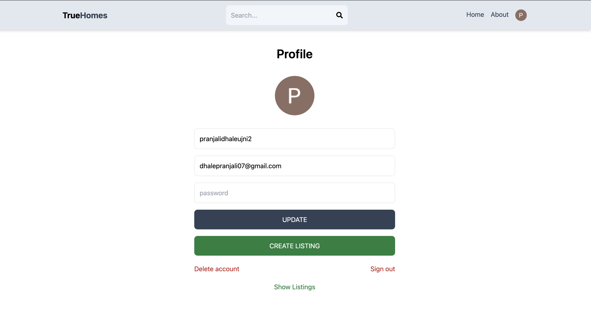

# True Homes

True Homes is a real estate application designed to help users find their dream homes. It utilizes MongoDB, Express.js, React.js, Node.js, Redux, JWT, and Firebase to provide a secure and efficient platform for users to search and filter listings.

## Features

- **Secure Authentication**: User data is protected using Google and JWT authentication, ensuring privacy and platform safety.
- **Advanced Search**: Users can easily filter listings by price, type, and amenities, simplifying the process of finding the perfect home.

## Technologies Used

- **MongoDB**: NoSQL database used to store listing data.
- **Express.js**: Web application framework for Node.js used for backend development.
- **React.js**: JavaScript library for building user interfaces.
- **Node.js**: JavaScript runtime environment used for server-side scripting.
- **Redux**: State management library for React applications.
- **JWT (JSON Web Tokens)**: Used for secure authentication and authorization.
- **Firebase**: Platform for building and managing web applications.

## Installation

1. Clone the repository: `git clone https://github.com/your/repo.git`
2. Navigate to the project directory: `cd true-homes`
3. Install dependencies:
   - Backend: `npm install`
   - Frontend: `cd client && npm install`
4. Set up Firebase:
   - Create a Firebase project and set up authentication.
   - Add your Firebase configuration to the appropriate files (`firebase.js`).
5. Start the development server:
   - Backend: `npm run server`
   - Frontend: `npm run client`

## Usage

1. Register or log in to your account using Google authentication.
2. Use the advanced search feature to filter listings by price, type, and amenities.
3. Browse through the listings and click on a property for more details.

## Screenshots

![Screenshot] (Screenshot 2024-04-23 at 8.07.07 PM.png)

![Screenshot] (Screenshot 2024-04-23 at 8.07.26 PM.png)

![Screenshot] (Screenshot 2024-04-23 at 8.10.49 PM.png)

